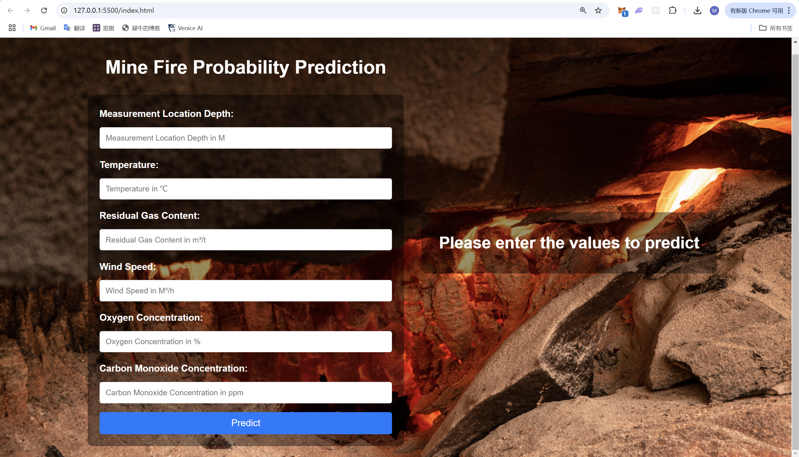
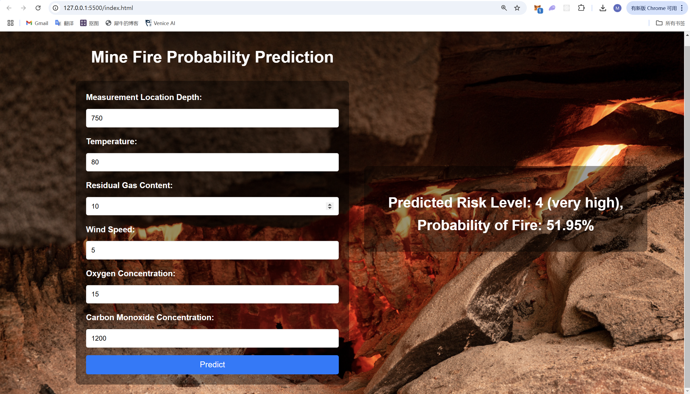

---

# Mine Fire Risk Prediction

This project predicts the risk level and probability of a mine fire based on various input parameters such as temperature, wind speed, and gas concentrations. The system uses two machine learning models:
1. **Support Vector Machine (SVM)** for predicting the mine fire **risk level**.
2. **Logistic Regression** for predicting the **probability** of a fire occurring.

The project consists of a Flask backend to serve the models and an HTML frontend for the user to interact with the system.

---

## Table of Contents

1. [Project Overview](#project-overview)
2. [Features](#features)
3. [Requirements](#requirements)
4. [Setup](#setup)
5. [How to Run Locally](#how-to-run-locally)
6. [How to Use](#how-to-use)
7. [Screenshots](#screenshots)
8. [Future Enhancements](#future-enhancements)

---

## Project Overview

This project includes:
- **Backend**: A Flask server that handles requests, loads pre-trained machine learning models, and serves predictions.
- **Frontend**: A simple HTML form that collects user input and displays the results, including risk levels and fire probability.

---

## Features

- Predicts fire risk levels (low, medium, high, very high).
- Provides the probability of fire occurrence as a percentage.
- Fully functional web interface that communicates with the backend server.
- Supports multiple input parameters including temperature, wind speed, oxygen concentration, etc.

---

## Requirements

Before running the project, ensure you have the following installed:
- Python 3.8+
- pip (Python package manager)
- A modern web browser (e.g., Chrome, Firefox)

---

## Setup

### 1. Clone the Repository

```bash
git https://github.com/Modi888/Mine_Fire_Prediction
cd mine-fire-prediction
```

### 2. Set Up a Virtual Environment

```bash
python -m venv venv
source venv/bin/activate  # macOS/Linux
venv\Scripts\activate     # Windows
```

### 3. Install Dependencies

Install the required Python libraries:

```bash
pip install -r requirements.txt
```

---

## How to Run Locally

### 1. Prepare the Dataset

Ensure that the `data.csv` file is present and has the necessary columns, including `ProbabilityOfFire` (normalized between 0 and 1) and `DangerousDegree`. The `train_model.py` script will handle model training.

### 2. Train the Models

Run the `train_model.py` script to train the models:

```bash
python train_model.py
```

This will train two models:
- **SVM** for predicting the risk level.
- **Logistic Regression** for predicting the fire probability.

It will also save the models (`svm_risk_model.pkl` and `logistic_fire_model.pkl`) and the feature scaler (`scaler.pkl`).

### 3. Start the Backend Server

Run the Flask backend:

```bash
python app.py
```

The server will start and be available at `http://127.0.0.1:5000`.

### 4. Open the Frontend

Open the `index.html` file in your browser. This provides a form where you can input the required parameters and get predictions.

---

## How to Use

1. **Navigate to the Webpage**:
   Open `index.html` in your browser.

2. **Input Values**:
   Enter the required parameters:
   - Measurement Location Depth
   - Temperature
   - Residual Gas Content
   - Wind Speed
   - Oxygen Concentration
   - Carbon Monoxide Concentration

3. **Submit**:
   Click the "Predict" button.

4. **View Results**:
   - Risk Level: Displays the risk category (low, medium, high, very high).
   - Probability: Shows the likelihood of a fire occurring as a percentage.

---

## Screenshots

### Prediction Form



### Prediction Result



---

## Future Enhancements

- Add support for real-time data streaming or dynamic updates.
- Deploy the backend to a cloud platform like AWS or Heroku.
- Improve the UI with more interactive features like charts or graphs.
- Extend the model to predict additional outcomes related to mining safety.

---

### Notes

- **CORS Issue**: If you encounter a CORS issue when making requests from the frontend to the backend, ensure that `Flask-CORS` is properly configured in `app.py`.
- **Backend Server**: The backend must be running for the frontend to make predictions.
- **Training Data**: Ensure that the training dataset (`data.csv`) is properly formatted with normalized `ProbabilityOfFire` values.

